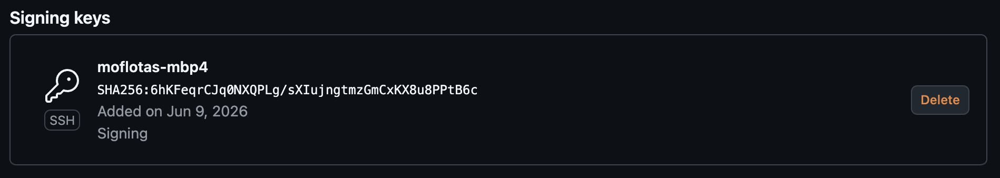
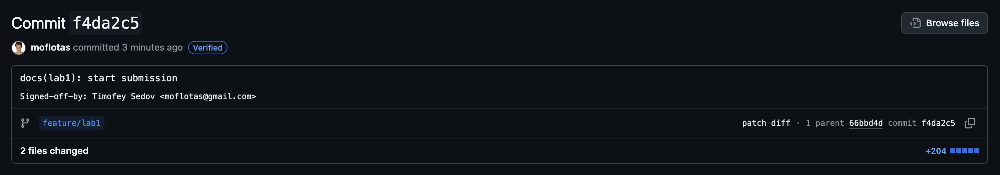

# Lab 1 submission

## Prerequisites

Checked all tools

```
❯ git --version
git version 2.54.0
❯ go version
go version go1.26.3 darwin/arm64
❯ ssh -V
OpenSSH_10.2p1, LibreSSL 3.3.6
```

My github account: https://github.com/moflotas
It has ssh key uploaded

## Task 1 — SSH Commit Signing & First Signed Commit (6 pts)

### 1.1: Fork the Course Repository

I forked the repo to [github](https://github.com/moflotas/DevOps-Intro)

```
❯ cd DevOps-Intro

❯ git remote add upstream git@github.com:inno-devops-labs/DevOps-Intro.git
❯ git fetch --all
Fetching origin
Fetching upstream
remote: Enumerating objects: 22, done.
remote: Counting objects: 100% (12/12), done.
remote: Compressing objects: 100% (2/2), done.
remote: Total 22 (delta 10), reused 11 (delta 10), pack-reused 10 (from 1)
Unpacking objects: 100% (22/22), 4.38 KiB | 373.00 KiB/s, done.
From github.com:inno-devops-labs/DevOps-Intro
 * [new branch]      bug/bisect-me -> upstream/bug/bisect-me
 * [new branch]      main          -> upstream/main
 * [new branch]      release/f25   -> upstream/release/f25
 * [new branch]      s26           -> upstream/s26
 * [new branch]      s26-refactor  -> upstream/s26-refactor
 * [new tag]         v0.0.1        -> v0.0.1
❯ ls app
Makefile		go.mod			handlers_test.go	seed.json		store_test.go
README.md		handlers.go		main.go			store.go
```

### 1.2: Run QuickNotes

In one terminal

```
❯ cd app/
go run .
2026/06/09 18:57:05 quicknotes listening on :8080 (notes loaded: 4)
```

In another terminal

```
❯ curl -s http://localhost:8080/health | python3 -m json.tool
{
    "notes": 4,
    "status": "ok"
}
❯ curl -s http://localhost:8080/notes  | python3 -m json.tool
[
    {
        "id": 3,
        "title": "DevOps mantra",
        "body": "If it hurts, do it more often.",
        "created_at": "2026-01-15T10:10:00Z"
    },
    {
        "id": 4,
        "title": "Endpoint cheat-sheet",
        "body": "GET /notes  GET /notes/{id}  POST /notes  DELETE /notes/{id}  GET /health  GET /metrics",
        "created_at": "2026-01-15T10:15:00Z"
    },
    {
        "id": 1,
        "title": "Welcome to QuickNotes",
        "body": "This is the project you'll containerize, deploy, monitor, and harden across all 10 labs.",
        "created_at": "2026-01-15T10:00:00Z"
    },
    {
        "id": 2,
        "title": "Read app/main.go first",
        "body": "Start by understanding the entry point \u2014 env vars, signal handling, graceful shutdown.",
        "created_at": "2026-01-15T10:05:00Z"
    }
]
❯ curl -s -X POST http://localhost:8080/notes \
  -H 'Content-Type: application/json' \
  -d '{"title":"hello","body":"first POST"}' | python3 -m json.tool
{
    "id": 5,
    "title": "hello",
    "body": "first POST",
    "created_at": "2026-06-09T15:58:55.967604Z"
}
❯ curl -s http://localhost:8080/notes  | python3 -m json.tool
[
    {
        "id": 1,
        "title": "Welcome to QuickNotes",
        "body": "This is the project you'll containerize, deploy, monitor, and harden across all 10 labs.",
        "created_at": "2026-01-15T10:00:00Z"
    },
    {
        "id": 2,
        "title": "Read app/main.go first",
        "body": "Start by understanding the entry point \u2014 env vars, signal handling, graceful shutdown.",
        "created_at": "2026-01-15T10:05:00Z"
    },
    {
        "id": 3,
        "title": "DevOps mantra",
        "body": "If it hurts, do it more often.",
        "created_at": "2026-01-15T10:10:00Z"
    },
    {
        "id": 4,
        "title": "Endpoint cheat-sheet",
        "body": "GET /notes  GET /notes/{id}  POST /notes  DELETE /notes/{id}  GET /health  GET /metrics",
        "created_at": "2026-01-15T10:15:00Z"
    },
    {
        "id": 5,
        "title": "hello",
        "body": "first POST",
        "created_at": "2026-06-09T15:58:55.967604Z"
    }
]
```

### 1.3: Configure SSH Signing

I configured those using nix:

```
{
  programs.git = {
    enable = true;

    ignores = [
      ".DS_Store"
      ".cursor"
      ".idea"
      ".vscode"
      "shell.nix"
    ];

    settings = {
      user = {
        name = "Timofey Sedov";
        email = "moflotas@gmail.com";
      };

      # for ssh signing of commits
      gpg.format = "ssh";
      user.signingkey = "~/.ssh/id_ed25519.pub";
      commit.gpgsign = true;
      tag.gpgsign = true;

      push.autoSetupRemote = "true";

      core.editor = "nvim";
    };
  };
}
```

After rebuilding the system here are the contents of `~/.config/git/config`

```
❯ cat ~/.config/git/config
[commit]
	gpgsign = true

[core]
	editor = "nvim"

[gpg]
	format = "ssh"

[push]
	autoSetupRemote = "true"

[tag]
	gpgsign = true

[user]
	email = "moflotas@gmail.com"
	name = "Timofey Sedov"
	signingkey = "~/.ssh/id_ed25519.pub"
```

I added the key to github



### 1.4: Make a Signed Commit

```
❯ git switch -c feature/lab1
Switched to a new branch 'feature/lab1'
❯ mkdir -p submissions
❯ echo "# Lab 1 submission" >> submissions/lab1.md
❯ git add submissions/lab1.md
❯ git commit -S -s -m "docs(lab1): start submission"
[feature/lab1 acbe658] docs(lab1): start submission
 2 files changed, 204 insertions(+)
 create mode 100644 submissions/images/lab1/01-signed-key.png
 create mode 100644 submissions/lab1.md
 ```

Verify the signature locally:

```
❯ git log --show-signature -1
commit f4da2c5327a14702e8226cc6ae7486f83c47f952 (HEAD -> feature/lab1, origin/feature/lab1)
Good "git" signature for moflotas@gmail.com with ED25519 key SHA256:6hKFeqrCJq0NXQPLg/sXIujngtmzGmCxKX8u8PPtB6c
Author: Timofey Sedov <moflotas@gmail.com>
Date:   Tue Jun 9 22:58:39 2026 +0300

    docs(lab1): start submission
    
    Signed-off-by: Timofey Sedov <moflotas@gmail.com>
```

Pushing to branch:

```
❯ git push -u origin feature/lab1
Enumerating objects: 8, done.
Counting objects: 100% (8/8), done.
Delta compression using up to 12 threads
Compressing objects: 100% (5/5), done.
Writing objects: 100% (7/7), 52.48 KiB | 26.24 MiB/s, done.
Total 7 (delta 1), reused 0 (delta 0), pack-reused 0 (from 0)
remote: Resolving deltas: 100% (1/1), completed with 1 local object.
remote: 
remote: Create a pull request for 'feature/lab1' on GitHub by visiting:
remote:      https://github.com/moflotas/DevOps-Intro/pull/new/feature/lab1
remote: 
To github.com:moflotas/DevOps-Intro.git
 * [new branch]      feature/lab1 -> feature/lab1
branch 'feature/lab1' set up to track 'origin/feature/lab1'.
```

Verified commit



### 1.5: Document in `submissions/lab1.md`

I already solved 3 tasks, the only one left is

> A 2-3 sentence explanation: *why* signed commits matter (referencing the xz-utils March 2024 story from Lecture 1)

TODO

## Task 2 — Pull Request Template & First PR (3 pts)
